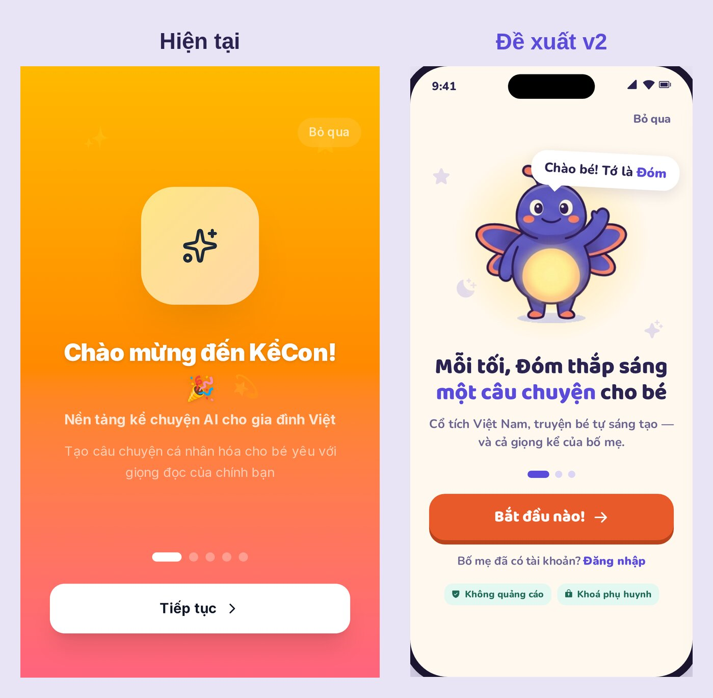
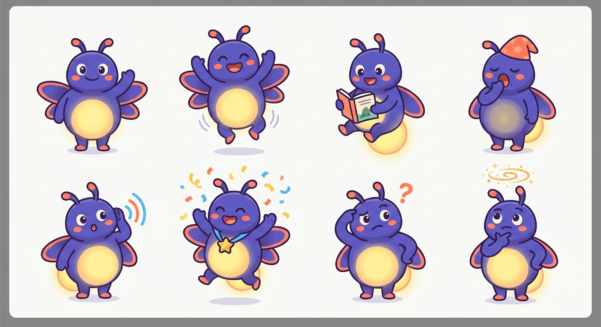
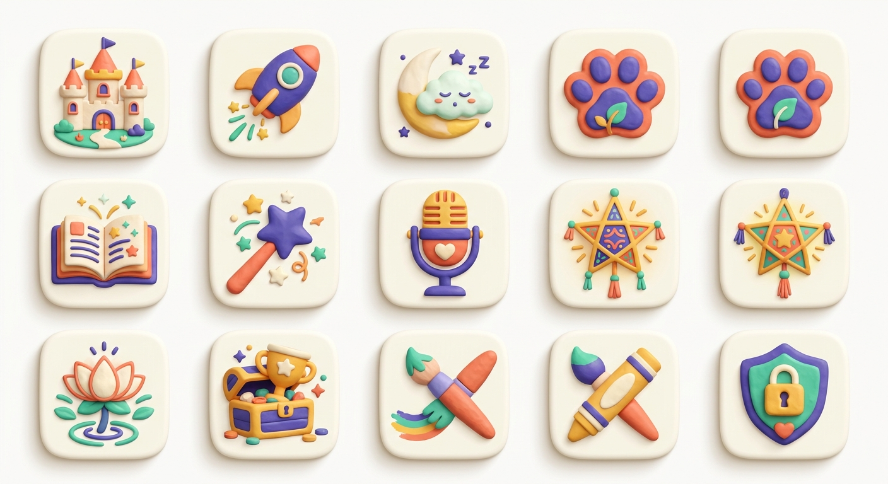
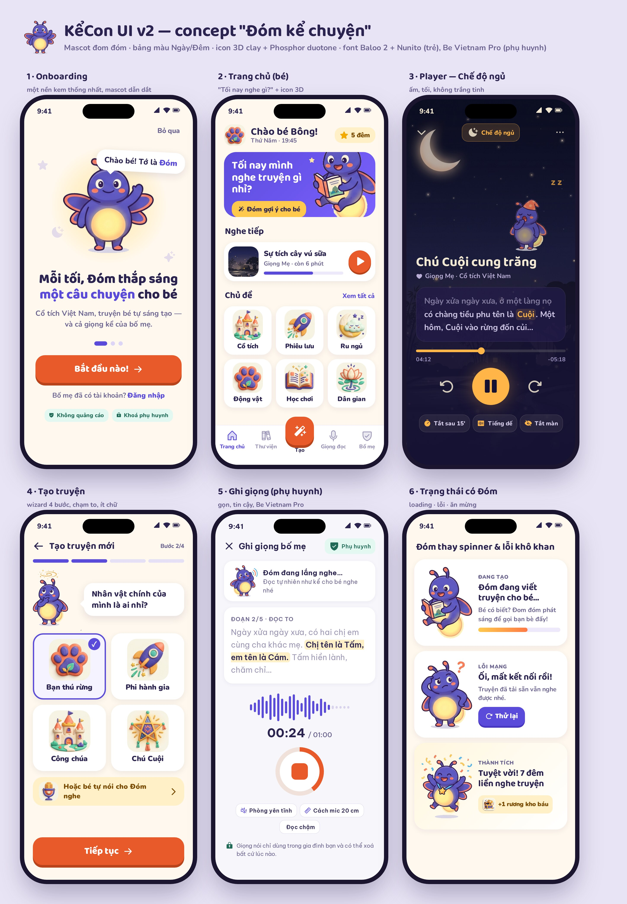

# 🎨 KểCon UI v2 — Mascot "Đóm", hệ màu Ngày/Đêm, icon & typography

> Nghiên cứu nâng cấp UI mobile. Bản đầy đủ (kèm trích dẫn nguồn) nằm trên Notion: *KểCon — Nghiên cứu nâng cấp UI mobile (mascot, visual, icon)*.

## ✅ Quyết định đã chốt

| # | Câu hỏi | Quyết định |
| --- | --- | --- |
| 1 | Mascot | **A — Đóm** (chú đom đóm kể chuyện) |
| 2 | Nhóm tuổi | **Bắt đầu từ 3–5 tuổi**, sau đó UI "lớn cùng bé" qua 6–8 và 9–12 (xem mục 6) |
| 3 | Chip "Không quảng cáo" ở onboarding | **Giữ nguyên** |

## 1. Hiện trạng (audit)

- Token `#FF6B3D / #7B61FF / #00D68F` nhưng có 75 lớp `bg-gradient-to-*` → mỗi màn một gradient, onboarding 5 slide = 5 gradient.
- Tương phản: chữ trắng trên `#FF6B3D` = 2,83:1, trên `#00D68F` = 1,91:1, trên `#FFB800` = 1,73:1 → trượt WCAG AA.
- `lucide-react` ở 46 file (nét mảnh, "người lớn"); danh mục dùng emoji 🏰🚀🌙🐾📚✨ (khác nhau giữa iOS/Android).
- Spinner `Loader2` 66 lần / 31 file; font Inter trung tính; không có mascot; chưa có chế độ đi ngủ.

## 2. Định hướng

| Chế độ | Ai dùng | Đặc điểm |
| --- | --- | --- |
| **Bé · Ngày** | Bé | Nền kem `#FFF8EE`, mascot nhiều, icon 3D, Baloo 2 + Nunito, có gamification |
| **Bé · Đêm** | Bé trước giờ ngủ | Nền `#151233`, chữ kem `#F3E9D2`, nút hổ phách `#FFB547`; không trắng tinh, không confetti/streak; animation ≥ 600ms |
| **Phụ huynh** | Bố mẹ | Be Vietnam Pro, nền `#F7F6FB`, ít mascot, sau cổng PIN (T03/T19) |

## 3. Mascot Đóm

- **Tagline:** "Mỗi tối, Đóm thắp sáng một câu chuyện cho bé."
- **Tính cách:** tò mò, ấm áp, khen cụ thể, hơi vụng về đáng yêu. Xưng "tớ – bé", câu ≤ 12 từ.
- **Không bao giờ:** doạ, làm bé thấy có lỗi, buồn bã để giữ chân, thúc mua hàng.
- **Ánh sáng là tín hiệu UI:** sáng rực khi vui, nhấp nháy khi lắng nghe, sáng dần khi đang tạo truyện, mờ dần khi bé sắp ngủ.

| # | Trạng thái (`state`) | Khi nào | Input Rive (v2) |
| --- | --- | --- | --- |
| 1 | `hello` | Mở app, onboarding | `mood=idle` |
| 2 | `happy` | Hoàn thành bước | `mood=happy` |
| 3 | `story` | Gợi ý / kể truyện ban ngày | `isTalking` |
| 4 | `sleepy` | Chế độ Đêm, Ru ngủ | `mood=sleepy`, `glow` |
| 5 | `listen` | Ghi giọng, bé nói | `isListening`, `audioLevel` |
| 6 | `celebrate` | Streak, huy hiệu | `trigger=celebrate` |
| 7 | `oops` | Lỗi, không có kết quả | `mood=oops` |
| 8 | `thinking` | AI đang tạo | `mood=thinking`, `progress` |

**Âm thanh, rung & câu thoại (UI-11):** 15 câu thoại (mỗi khoảnh khắc một câu, ≤ 12 từ, xưng "tớ – bé") nằm trong `src/lib/dom-lines.ts`; Đóm hiện bong bóng và đọc to bằng giọng tiếng Việt của máy (không có giọng tiếng Việt → chỉ hiện chữ; không nói khi mic đang mở hay truyện đang đọc). Âm chạm/chuông là Web Audio tổng hợp (không file), rung 6–28 ms qua `navigator.vibrate`. Bố mẹ tắt từng kênh trong tab Bố mẹ → "Âm thanh & rung"; Chế độ ngủ tắt âm + giọng, bong bóng chuyển tông đêm. Bản sau: thu âm giọng Đóm thật thay TTS của máy.

> Ảnh trong thư mục này là **concept do AI tạo** để chốt hướng. Bản production cần hoạ sĩ vẽ lại vector + rig Rive.

Phương án đã cân nhắc: [mascot-options-abc.jpg](concepts/mascot-options-abc.jpg) (A Đóm · B Cú mèo · C Nghé).

## 4. Màu & chữ

Token dán vào `@theme` của Tailwind v4: [`kecon-tokens.css`](kecon-tokens.css).

| Token | Hex | Dùng cho | Tương phản |
| --- | --- | --- | --- |
| brand | `#5B4BDB` | Link, trạng thái chọn | trắng 6,0:1 |
| cta | `#E85A2A` | CTA chính (chữ trắng ≥ 18px đậm) | 3,5:1 (chữ lớn) |
| glow | `#FFC94D` | Thưởng, highlight | ink 9,4:1 |
| ink / ink-2 | `#2B2350` / `#6B6390` | Chữ trên nền kem | 13,6:1 / 5,2:1 |
| night-bg / moon | `#151233` / `#F3E9D2` | Chế độ Đêm | 14,9:1 |
| amber | `#FFB547` | Play/tiến độ ban đêm | icon tối 10,3:1 |

**Chữ nhỏ (UI-12, WCAG AA 4,5:1):** nền `brand`/`cta` giữ nguyên, còn *chữ* dùng biến thể đậm: `text-brand-ink` (`#5B4BDB`, đêm `#B3A8FF`), `text-cta-ink` (`#B9441C`, đêm `#FF9A70`), chữ trên nền `glow` dùng `text-on-glow` (`#2B2350`). Nút cam `bg-cta` chỉ dùng chữ trắng **≥ 19px đậm** (chữ lớn 3:1). Không dùng `text-gray-300/400` hay độ mờ `/30–/60` cho chữ — tối thiểu `text-ink-2` / `text-gray-600` (`dark:text-white/70`). Kiểm tra tự động: `tests/e2e/a11y.spec.ts` (axe-core, WCAG 2.1 A/AA).

| Vai trò | Font | Cỡ |
| --- | --- | --- |
| Tiêu đề (bé) | Baloo 2 700–800 | 24–32px, line-height ≥ 1,15 |
| UI (bé) | Nunito 700–900 | 15–18px |
| Văn bản truyện | Nunito 700 | 19–22px, line-height 1,6 |
| Phụ huynh | Be Vietnam Pro 400–700 | 14–17px |

## 5. Icon & minh hoạ

- **Icon UI:** Phosphor — duotone khi chưa chọn, fill khi chọn; thay toàn bộ lucide.
- **Icon chủ đề:** 3D clay WebP thay emoji — Cổ tích = lâu đài, Phiêu lưu = tên lửa, Ru ngủ = trăng + mây, Động vật = dấu chân, Học chơi = sách, Tuỳ chỉnh/AI = đũa phép, Dân gian = hoa sen, Trung Thu = đèn ông sao.
- **Minh hoạ:** nền đêm làng quê Việt ([night-bg.jpg](assets/night-bg.jpg)) cho Player/Ru ngủ.
- ⚠️ Mascot 2D flat vs icon 3D clay: bản production phải đồng bộ palette/viền/ánh sáng.

## 6. Lớn cùng bé (age bands)

| Nhóm | Ưu tiên | Đặc điểm UI |
| --- | --- | --- |
| **3–5 (v1)** | ✅ Làm trước | Icon + âm thanh thay chữ (chạm icon → đọc tên), 1 việc/màn, nút ≥ 64px, Đóm luôn dẫn dắt, truyện ngắn 3–7 phút |
| 6–8 | Sau | Chữ ngắn + karaoke, quiz từ vựng, nhiều lựa chọn hơn trong wizard |
| 9–12 | Sau nữa | Ít "cartoon" hơn, Đóm thu nhỏ thành bạn đồng hành, bé tự viết/sửa truyện |

Nhóm tuổi lấy từ hồ sơ của bé; phụ huynh đổi được. Tránh nội dung "trẻ con hơn tuổi" (NN/g).

**Đã làm (UI-13):** `src/lib/age-ui.ts` (`AGE_UI`) + `AgeUiProvider` đặt `html[data-age|data-density|data-say-labels]` từ tuổi trong **Bố mẹ → Hồ sơ gia đình** (mặc định 3–5; đồng bộ sang `settings.childAge` để Tạo truyện / Vẽ truyện / gợi ý dùng cùng nhóm).

| | 3–5 "Mầm" | 6–8 "Chồi" | 9–12 "Lá" |
| --- | --- | --- | --- |
| Chạm tối thiểu `--kid-tap` | 64px | 56px | 48px |
| `Button3D` lg / md / sm | 68 / 56 / 48 | 64 / 48 / 44 | 56 / 46 / 44 |
| Mật độ chữ | thấp — ẩn `[data-kid-detail]` | vừa | cao — hiện thêm `[data-kid-extra]` (mô tả truyện) |
| Chạm `[data-say]` → Đóm đọc tên | ✅ | — | — |
| Trang chủ: Chủ đề / Khám phá thêm | 2 cột ô to · 3 lối tắt | 3 cột · tất cả | 3 cột gọn · tất cả |
| Đóm (`--dom-scale`) | 1 | 1 | 0.78 |

Màn mới: gắn `data-say="Tên"` cho nút biểu tượng của bé, `data-kid-detail` cho dòng phụ, `data-kid-extra` cho mô tả dài. Test: `tests/unit/age-ui.test.ts`, `tests/e2e/age-bands.spec.ts`.

## 7. Mockup

Mở [`mockups/board.html`](mockups/board.html) bằng trình duyệt để xem bản HTML (font Google Fonts + Phosphor qua CDN).

## 8. Kế hoạch

Xem mục **UI v2** trong [`docs/plan.md`](../../plan.md) — ticket UI-01 → UI-13.

## Chế độ ngủ — ngữ nghĩa (PR #9)

- **Tự động (mặc định, 19:30–6:00):** chỉ làm tối các màn "giờ ngủ" — Player (pill "Chế độ ngủ" bật sẵn, Đóm `sleepy`) và Ru ngủ. `<html>` có class `bedtime`; Trang chủ và các màn khác giữ nền kem như concept "Home bé 19:45".
- **Luôn bật** (tab Bố mẹ → Chế độ ngủ) hoặc **Giao diện tối**: toàn app dùng bảng màu đêm (class `night`), không phần tử nào trắng tinh `#FFF`.
- Trong Player, bé/bố mẹ có thể bật/tắt "Chế độ ngủ" cho riêng lần nghe đó bằng pill trên cùng.
- Ảnh so sánh concept ↔ app: [screens/v2-fidelity.jpg](screens/v2-fidelity.jpg).

